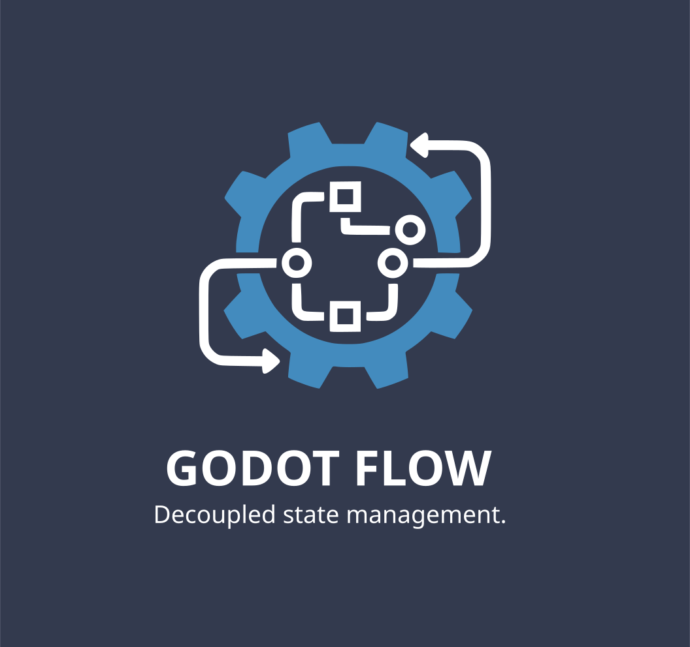
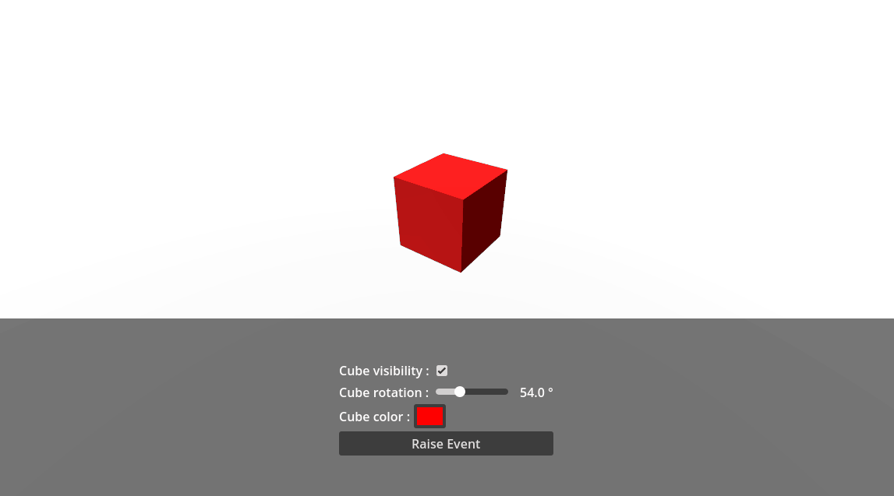

# Godot Flow Sample Project



This repository is a Godot 4.x project that ships a small “Flow” framework built around **typed Resource variables** and **Resource events**, plus optional **editor extensions** for inspecting and editing their runtime state while the game is running.

It’s intended for a decoupled, data-driven workflow:

- Store gameplay state in `.tres` Resources (Bool/Int/Float/String/Color/Vector2/Vector3 variables).
- Listen to changes via signals (`value_changed`) instead of wiring node references everywhere.
- Use `.tres` Events to broadcast occurrences (`event_raised`) without tightly coupling sender/receiver.
- (Optional) Use the editor docks to watch/edit values and raise events live during play.

## Project layout

- `addons/godot_flow_core/`
  - Runtime: variable and event Resource types, runtime reporters, debug logging helpers.
  - Editor: a tiny plugin that silences custom debugger messages when the extensions plugin is disabled.
- `addons/godot_flow_extensions/`
  - Editor-only: docks/debugger plugins for viewing runtime variable values and events.
  - Context menu action to scan/log where a variable `.tres` is referenced.
- `samples/`
  - Example scenes, resources, and scripts showing typical usage.

## Requirements

- Godot 4.5 (this project has `config/features` set to `4.5` in `project.godot`).
- Windows PowerShell (`pwsh`) only if you want to use the code-generation script.

## Enabling the plugins

In the Godot editor:

1. Open **Project → Project Settings… → Plugins**
2. Enable:
   - **Godot Flow Core** (safe to enable always)
   - **Godot Flow Extensions** (optional, editor UI)

Notes:

- If you run the game with the runtime reporters active but **without** the Extensions plugin enabled, Godot’s editor can log warnings like “Unknown message: variable_values:update”. The Core plugin includes a small `EditorDebuggerPlugin` that consumes those messages to keep the Output clean.

## Installation into another project

If you want to reuse this in a different Godot project, copy these folders into that project:

- `addons/godot_flow_core/`
- `addons/godot_flow_extensions/` (optional)

Then enable the plugin(s) as described above.

## Core concepts

### Variables (typed Resource state)

Variables are `Resource`s that hold a typed value and emit a signal when the value changes.

Available variable types (scripts live under `addons/godot_flow_core/scripts/variables/`):

- `BoolVariable`
- `IntVariable`
- `FloatVariable`
- `StringVariable`
- `ColorVariable`
- `Vector2Variable`
- `Vector3Variable`

Common API (implemented via `BaseVariable`):

- `value` property (typed per variable)
- `value_changed(new_value)` signal
- `initial_value` exported property
- `debug_logs` exported bool: when enabled, logs value changes + a stack trace + which listeners are connected
- `save_to_device` exported bool: persists changes to `user://settings.cfg` and reloads on startup
  - stored in section `variables`
  - key is the variable’s `resource_path.get_basename()`

#### Creating a variable resource

1. In the FileSystem dock: **Right click → New Resource…**
2. Pick e.g. `BoolVariable` and save it as a `.tres`.
3. Assign that `.tres` to exported fields in scripts.

#### Using variables in scripts

```gdscript
extends Node

@export var bool_variable: BoolVariable

func _ready() -> void:
	bool_variable.value_changed.connect(_on_bool_changed)
	print("Initial value:", bool_variable.value)

func _on_bool_changed(new_value: bool) -> void:
	print("Bool changed to:", new_value)
```

When you want better debug output that includes the caller, prefer the typed helper method:

```gdscript
bool_variable.set_value(true, self)
```

### Events (typed-less Resource signals)

Events are `Resource`s that expose a single signal and a method to emit it.

- Script: `addons/godot_flow_core/scripts/events/event.gd`
- API:
  - `signal event_raised()`
  - `func raise_event() -> void`
  - `debug_logs` exported bool (prints a rich debug log when raised)

#### Using events in scripts

Listener:

```gdscript
extends Node

@export var event: Event

func _ready() -> void:
	event.event_raised.connect(_on_event_raised)

func _on_event_raised() -> void:
	print("Event received!")
```

Raiser:

```gdscript
extends Node

@export var event: Event

func trigger() -> void:
	event.raise_event()
```

## Built-in UI bindings (optional)

The core addon includes a few small “driven” UI scripts you can attach to UI controls to keep them synced with variables.

Examples:

- `addons/godot_flow_core/scripts/ui/bool-driven-checkbox.gd`
  - Attach to a `CheckBox`, assign `bool_var: BoolVariable`.
  - User toggles update the variable; variable changes update the checkbox.
- `addons/godot_flow_core/scripts/ui/float-driven-slider.gd`
  - Attach to a `Slider`, assign `float_variable: FloatVariable`.
- `addons/godot_flow_core/scripts/ui/string-driven-label.gd`
  - Attach to a `Label`, assign `string_variable: StringVariable`.
- `addons/godot_flow_core/scripts/ui/color-driven-color-picker.gd`
  - Attach to a `ColorPickerButton`, assign `color_variable: ColorVariable`.

## Editor extensions (runtime inspection)

If you enable **Godot Flow Extensions**, you get extra tooling in the editor while playing:

### Variable Values dock

A dock named **Variable Values** shows any variables that report values during runtime.

- Live-updates as values change.
- Edit a value in-place to push the change back into the running game.
- Toggle `debug_logs` per variable (or bulk enable/disable).

Under the hood:

- Runtime sends debugger messages via `VariableRuntimeReporter`.
- Editor listens via `VariableValuesDebugger` and updates the dock UI.

### Events dock

A dock named **Events** shows events that are discovered/registered at runtime.

- Shows listener count and how many times each event was raised.
- Can raise an event from the editor while the game is running.
- Toggle `debug_logs` per event (or bulk enable/disable).

Under the hood:

- Runtime reports/updates via `EventRuntimeReporter`.
- Editor listens via `EventsDebugger` and updates the dock UI.

### “Log references” context action

In the FileSystem dock, right-click a variable `.tres` and choose **Log references** to print any `.tscn` / `.tres` files that reference it.

This is a best-effort text scan of project files (useful for refactors and cleanup).

### Clickable output links

When `debug_logs` are enabled, debug output may include clickable links that open the correct scene and select the node that caused the change/raise.

## Samples

The `samples/` folder contains example resources and scripts. The project’s main scene is set to the sample scene (`samples/main.tscn`).

A few scripts worth browsing:

- `samples/scripts/bind-bool-var-to-visibility.gd`
- `samples/scripts/bind-color-var-to-mat-albedo.gd`
- `samples/scripts/event-listener.gd`
- `samples/scripts/raise-event.gd`

## Developer notes

### Regenerating variable scripts

Variable scripts are generated from a template:

- Template: `addons/godot_flow_core/scripts/variables/variable.gd.template`
- Generator: `addons/godot_flow_core/tools/generate-variables.ps1`

Run from the project root (explicit paths so the script can find the template/output):

```powershell
pwsh -File .\addons\godot_flow_core\tools\generate-variables.ps1 \
  -TemplatePath addons/godot_flow_core/scripts/variables/variable.gd.template \
  -OutputDir addons/godot_flow_core/scripts/variables
```

Alternatively, run it from within the addon folder so the defaults resolve correctly:

```powershell
cd .\addons\godot_flow_core
pwsh -File .\tools\generate-variables.ps1
```

Use `-Force` to overwrite existing files, and `-Types` to generate a subset.

## Troubleshooting

- **The docks show nothing**: the runtime reporters only send updates when the game is running *with an active debugger connection*.
  - Run the project from the editor (F5) so the editor debugger attaches.
- **Warnings about unknown debugger messages**: enable the Core plugin (or enable Extensions if you want the full UI).
- **`save_to_device` isn’t restoring values**: the variable must be saved to disk (have a non-empty `resource_path`) so it can load/store a stable key.

## Credits

- Author: W3dge

## License

No license file is currently included in this repository. If you plan to distribute this publicly, consider adding a license that matches your intended usage.
