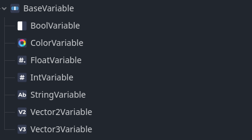

# MEDS - Cure your game from singletons!

## Quickstart

Download the latest project sample [release](https://github.com/joranmarcy/Godot-MEDS-Sample/archive/refs/tags/releases/0.1.0-alpha.4.zip)

[Download](https://godotengine.org/download/archive/4.5-stable/) & Install Godot 4.5

Start Godot and import the project sample.

Enjoy the MEDS [features](#features) !

> [!IMPORTANT]
> Full [Godot MEDS documentation](https://joranmarcy.github.io/Godot-MEDS-Docs/docs/intro) is available for setup, concepts, usage patterns, and examples.

## Presentation

Game engine architecture often involves a trade-off between short-term convenience and long-term maintainability. Early on, global singletons and monolithic "Manager" classes feel great: you can access game state from anywhere with minimal friction. But as projects grow, those patterns turn into hidden dependencies and fragile global state, making refactors risky and testing painful. [Ryan Hipple's Unite 2017 talk](https://www.youtube.com/watch?v=raQ3iHhE_Kk) popularized a strong alternative in the Unity ecosystem: a modular, data-driven architecture built on ScriptableObjects. The key idea is to decouple data from logic around three engineering pillars—every system should be **Modular**, **Editable**, and **Debuggable**.

Although the approach was born in Unity, the philosophy is engine-agnostic and maps cleanly to Godot through Custom Resources. MEDS is my port of this workflow to Godot. After years of practice with the Unity implementations, I ran into a recurring limitation: in larger projects it can be difficult to see and track references, which makes debugging and maintenance harder over time. This library is my attempt to keep the core idea lightweight while adding the tooling needed to stay debuggable as the project scales.

**MED** stands for **Modular**, **Editable**, and **Debuggable**—the pillars popularized by Ryan Hipple.

**S** stands for **Scalable**: an emphasis on making the approach work in larger projects by providing better tools to track dependencies between resources.

## Features

- Typed Resource variables (core GDScript primitives)
- Shared `NumericVariable` foundation for `FloatVariable` and `IntVariable`
- Numeric clamping, ranges, and `range_changed(...)` notifications
- Resource events (decoupled signaling)
- Reusable UI bindings for labels, sliders, progress bars, checkboxes, and color pickers
- Reset behavior through `reset_on`, with runtime caching for application-start resets
- Custom editor icons
- Save variable values
- Variable & event reference tracking
- Live variable debugger (read & edit values at runtime)
- Live event debugger (raise events from editor / monitor event raises)

### Custom resource icons

Custom icons make variables and events easier to identify at a glance in the editor.



### Live variables debugger

Inspect shared variable values during play mode from a single dock. You can also edit values live to validate bindings, gameplay reactions, and UI behavior without adding temporary debug code.


### Live event debugger

Monitor MEDS events as they are raised at runtime, or trigger them manually from the editor to test listeners without reproducing the full gameplay action.


### Editor-time reference tracking

Scan scenes, scripts, and assets to find where a variable resource is referenced before you rename, refactor, or remove it. This becomes especially useful once the same resource is reused across multiple systems.

### Runtime reaction tracking

Through the debug log option, you can see which nodes react to variable changes or event raises while the game is running, along with the stack trace and clickable links to the nodes involved. That makes it easier to follow the live dependency chain behind unexpected behavior.

------------------

## This Project Sample

This repository is a Godot 4.x sample project built using MEDS workflow. It has MEDS Core and MEDS Editor Tools plugin enabled. Full Godot MEDS Documentation is available [here](https://joranmarcy.github.io/Godot-MEDS-Docs)

The current sample centers on a small robot gameplay loop driven by shared variables and events:

- a menu edits shared MEDS resources through reusable UI bindings
- a robot scene reacts to rotation, visibility, health, and color variables
- a `take-damage` event triggers health loss and related gameplay reactions
- audio and scene transitions react to the same shared health resource

## Project layout

- `addons/godot_meds_core/`
  - Runtime: variable and event Resource types, numeric variable base classes, runtime reporters, debug logging helpers.
  - Reusable UI binding scripts under `scripts/ui/`.
  - Editor: a tiny plugin that silences custom debugger messages when the extensions plugin is disabled.
- `addons/godot_meds_editor/`
  - Editor-only: docks/debugger plugins for viewing runtime variable values and events.
  - Context menu action to scan/log where a variable `.tres` is referenced.
- `samples/`
  - Example scenes, resources, scripts, materials, sounds, and models showing a complete MEDS gameplay loop.

## Requirements

- Godot 4.5

## Running tests

This sample does not currently depend on an external Godot test framework.

Headless runtime tests are included for `FloatVariable` and `IntVariable`.

On Windows, use the provided PowerShell wrappers so test output is printed to the terminal:

```powershell
.\addons\godot_meds_core\scripts\tests\run_float_variable_tests.ps1
.\addons\godot_meds_core\scripts\tests\run_int_variable_tests.ps1
```

If you want to invoke Godot directly, use:

```powershell
godot_console --headless --path . -s res://addons/godot_meds_core/scripts/tests/float_variable_test_runner.gd
godot_console --headless --path . -s res://addons/godot_meds_core/scripts/tests/int_variable_test_runner.gd
```

## Enabling the plugins

In the Godot editor:

1. Open **Project → Project Settings… → Plugins**
2. Enable:
   - **Godot Meds Core**
   - **Godot Meds Editor Tools** (optional)


## Installation into another project

If you want to reuse this in a different Godot project, copy these folders into that project:

- `addons/godot_meds_core/`
- `addons/godot_meds_editor/` (optional)

Then enable the plugin(s) as described above.

## Samples

The `samples/` folder contains the main demo used throughout the documentation. The project's main scene is set to `samples/main.tscn`.

Main sample scenes:

- `samples/main.tscn`: entry point for the sample
- `samples/prefabs/menu.tscn`: MEDS-driven UI controls and displays
- `samples/prefabs/player.tscn`: robot prefab and gameplay listeners
- `samples/game-over.tscn`: game-over screen shown when health reaches zero

Main sample resources:

- `samples/resources/robot-health.tres`
- `samples/resources/damage-amount.tres`
- `samples/resources/robot-rotation.tres`
- `samples/resources/robot-visibility.tres`
- `samples/resources/robot-name.tres`
- `samples/resources/damage-color.tres`
- `samples/events/take-damage.tres`

Reusable UI bindings for MEDS variables live under `addons/godot_meds_core/scripts/ui/`, including:

- `variable-driven-label.gd`
- `variable-driven-slider.gd`
- `variable-driven-progress-bar.gd`
- `bool-driven-checkbox.gd`
- `color-driven-color-picker.gd`

Deprecated binding scripts were moved under `addons/godot_meds_core/scripts/ui/deprecated/`. Prefer the `variable-driven-*` replacements for new work.

A few scripts worth browsing:

- `samples/scripts/bind-bool-var-to-visibility.gd`
- `samples/scripts/bind-color-var-to-mat-albedo.gd`
- `samples/scripts/bind-float-var-to-rotation.gd`
- `samples/scripts/event-listener.gd`
- `samples/scripts/heartbeat-controller.gd`
- `samples/scripts/robot.gd`
- `samples/scripts/raise-event.gd`
- `samples/scripts/scene-manager.gd`

## Asset Credits

The Godot pixel plush asset used in the sample model was created by [potato_dude_100](https://sketchfab.com/potato_dude_100):

- [Godot Pixel Plush on Sketchfab](https://sketchfab.com/3d-models/godot-pixel-plush-a48f8f6e2c464adc815f59527037e3a6)

## Development Tools

These tools were especially helpful while building and maintaining this project:

- [Inkscape](https://inkscape.org/) for SVG icon work and other visual asset tweaks.
- [GDVM](https://github.com/embraceTheWind/gdvm) to manage Godot versions during development and testing.
- [Visual Studio Code](https://code.visualstudio.com/) for GDScript editing, project navigation, and release tooling.

## License

MIT — see `LICENSE`.
