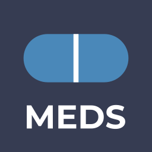
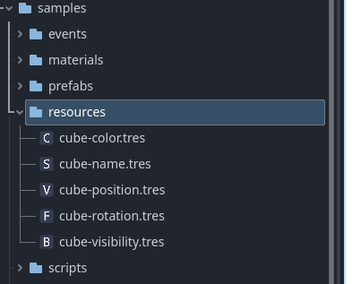
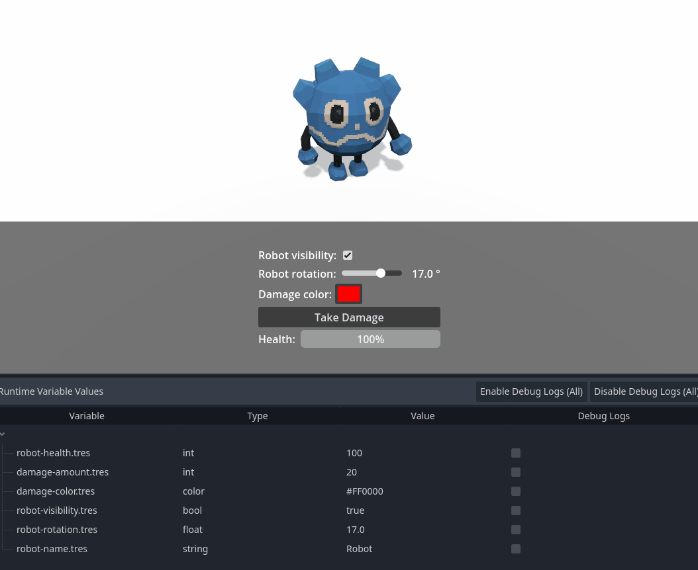
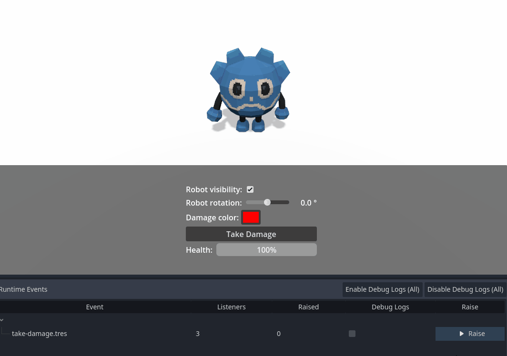
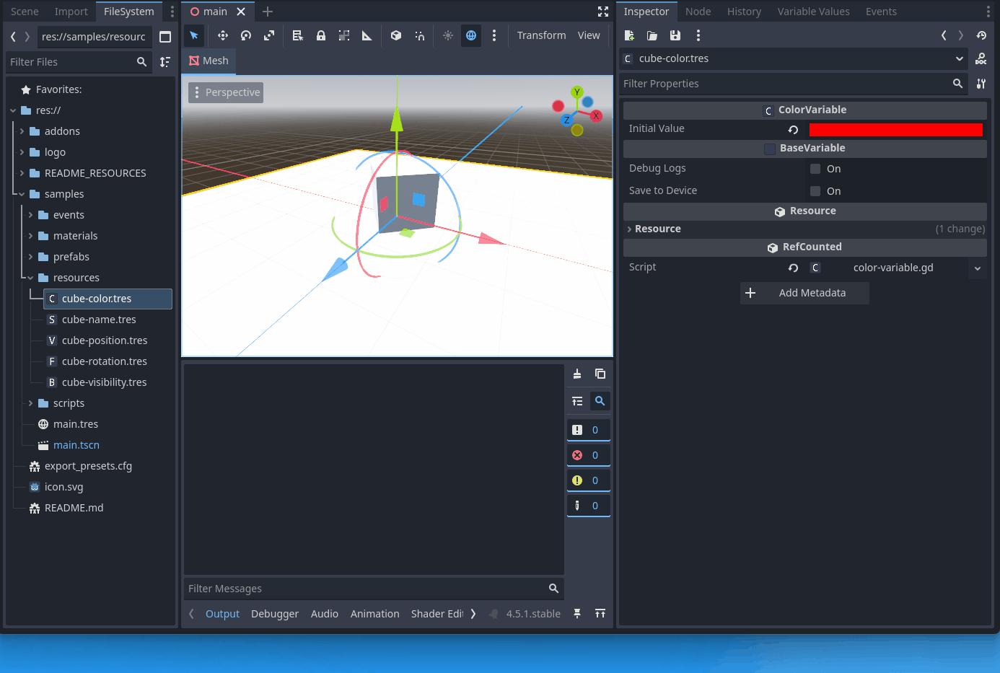
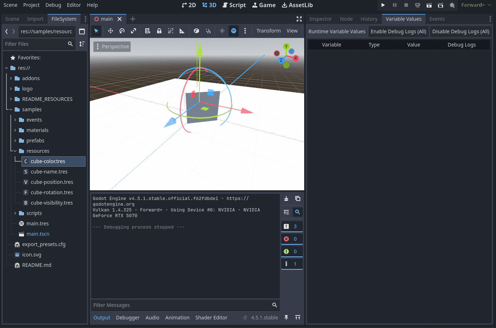

# MEDS - Cure your game from singletons!

## Quickstart

Download the [latest](https://github.com/joranmarcy/Godot-MEDS-Sample/releases/download/releases%2F0.1.0-alpha.1/godot-meds-project-sample-0.1.0-alpha.1.zip) project sample release from github: 

[Download](https://godotengine.org/download/archive/4.5-stable/) & Install Godot 4.5

Start Godot and import the project sample.

Enjoy et test the features !

## Presentation

Game engine architecture often involves a trade-off between short-term convenience and long-term maintainability. Early on, global singletons and monolithic "Manager" classes feel great: you can access game state from anywhere with minimal friction. But as projects grow, those patterns turn into hidden dependencies and fragile global state, making refactors risky and testing painful. [Ryan Hipple's Unite 2017 talk](https://www.youtube.com/watch?v=raQ3iHhE_Kk) popularized a strong alternative in the Unity ecosystem: a modular, data-driven architecture built on ScriptableObjects. The key idea is to decouple data from logic around three engineering pillars—every system should be **Modular**, **Editable**, and **Debuggable**.

Although the approach was born in Unity, the philosophy is engine-agnostic and maps cleanly to Godot through Custom Resources. MEDS is my port of this workflow to Godot. After years of practice with the Unity implementations, I ran into a recurring limitation: in larger projects it can be difficult to see and track references, which makes debugging and maintenance harder over time. This library is my attempt to keep the core idea lightweight while adding the tooling needed to stay debuggable as the project scales.

**MED** stands for **Modular**, **Editable**, and **Debuggable**—the pillars popularized by Ryan Hipple.

**S** stands for **Scalable**: an emphasis on making the approach work in larger projects by providing better tools to track dependencies between resources.

## Features

- Typed Resource variables (core GDScript primitives)
- Resource events (decoupled signaling)
- Custom editor icons
- Save variable values
- Variable & event reference tracking
- Live variable debugger (read & edit values at runtime)
- Live event debugger (raise events from editor / monitor event raises)

Custom resource icons :

Live variables debugger. Change and monitor event values :

Live event debugger. Raise and monitor events at runtime :

Easily track your resources usages at editor time :

And know at runtime who reacts to value or event raises :

------------------

## This Project Sample

This repository is a Godot 4.x sample project built using MEDS workflow. It has MEDS Core and MEDS Editor Tools plugin enabled. Full Godot MEDS Documentation is available [here](https://joranmarcy.github.io/Godot-MEDS-Docs)

## Project layout

- `addons/godot_meds_core/`
  - Runtime: variable and event Resource types, runtime reporters, debug logging helpers.
  - Editor: a tiny plugin that silences custom debugger messages when the extensions plugin is disabled.
- `addons/godot_meds_editor/`
  - Editor-only: docks/debugger plugins for viewing runtime variable values and events.
  - Context menu action to scan/log where a variable `.tres` is referenced.
- `samples/`
  - Example scenes, resources, and scripts showing typical usage.

## Requirements

- Godot 4.5

## Enabling the plugins

In the Godot editor:

1. Open **Project → Project Settings… → Plugins**
2. Enable:
   - **Godot Meds Core**
   - **Godot Meds Editor Tools** (optional)

## Installation into another project

If you want to reuse this in a different Godot project, copy these folders into that project:

- `addons/godot_meds_core/`
- `addons/godot_meds_editor/` (optional)

Then enable the plugin(s) as described above.

## Samples

The `samples/` folder contains example resources and scripts. The project’s main scene is set to the sample scene (`samples/main.tscn`).

A few scripts worth browsing:

- `samples/scripts/bind-bool-var-to-visibility.gd`
- `samples/scripts/bind-color-var-to-mat-albedo.gd`
- `samples/scripts/event-listener.gd`
- `samples/scripts/raise-event.gd`
